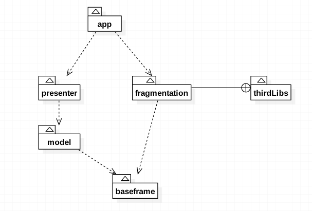

# 双杰充电桩项目

## 工程说明

### 工程整体结构

总共有五个模块

* 主模块 `app`
* 依赖模块 `model` `presenter` `baseframe` `thirdLibs`

|模块|说明|
|:--:|:--:|
|`app`| 是主工程  
|`model` |管理所有的javabean，以及作为仓库提供数据  
|`presenter` |负责数据逻辑封装  
|`baseframe` |是基础框架，提供通用型的view、工具类、基础依赖等  
|`thirdLibs`| 是第三方库的源码导入

依赖关系图

说明： 虚线箭头为依赖，右侧带十字圆的表示该库存放在指定的文件下。这里不包含`build.gradle`中的依赖

### 常见简写

|单词|缩写|
|:--:|:--:|
|Activity|aty|
|fragment|frgm|

### keystore

密码： sojocharging

## 第三方库使用记录

项目中引用到的第三方库记录说明

### 路由

> A android router middleware that help app navigating from external environment into internal activity.

使用路由以便后续要做混合开发扩展使用。

GITHUB地址：[https://github.com/alibaba/ARouter](https://github.com/alibaba/ARouter)

### 底部导航

GITHUB地址：[https://github.com/sephiroth74/Material-BottomNavigation](https://github.com/sephiroth74/Material-BottomNavigation)

### 二维码扫描库

GITHUB地址：[https://github.com/yipianfengye/android-zxingLibrary](https://github.com/yipianfengye/android-zxingLibrary)
